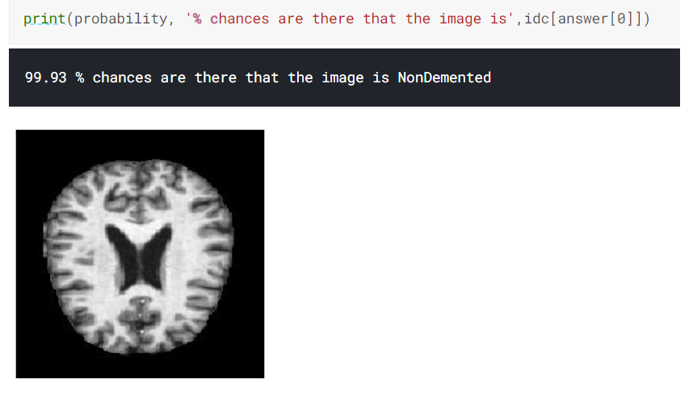
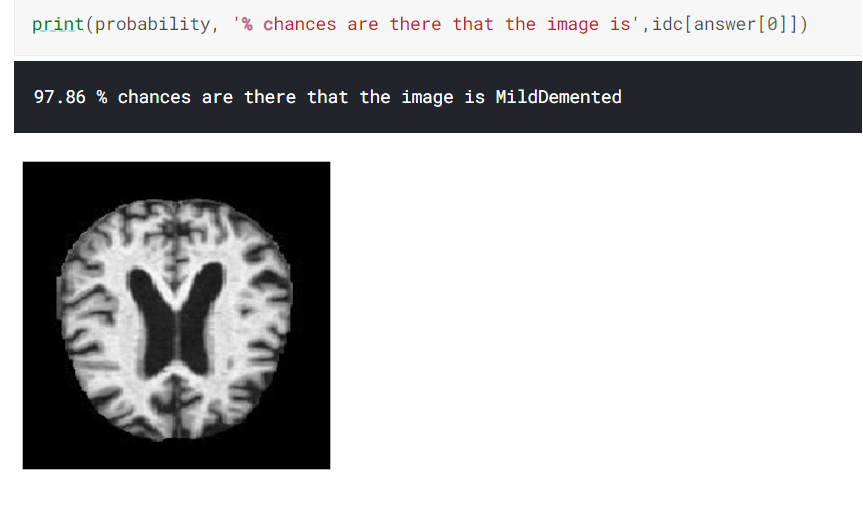
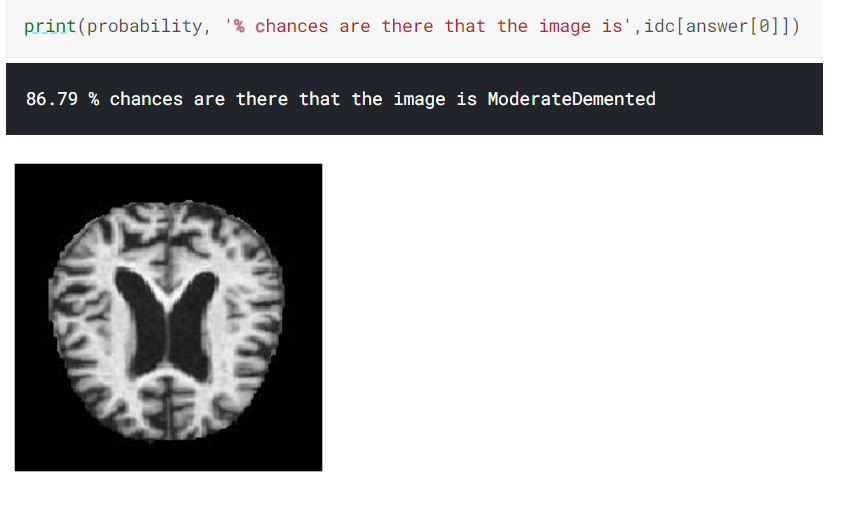
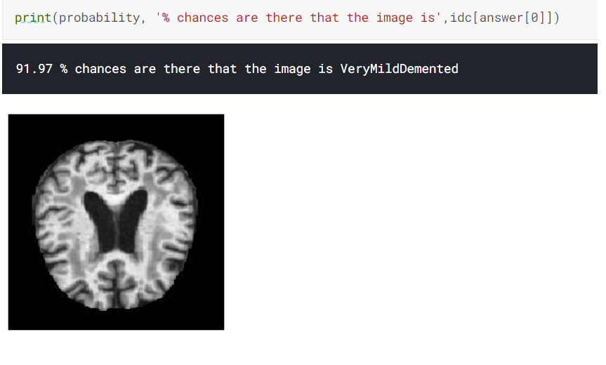

# Alzheimer-s-Classification-using-DenseNet169
A CNN model to classify Alzeimer's disease in a patient using DenseNet-169 pretrained keras weights 

DenseNet architecture explicitly differentiates between information that
is added to the network and information that is preserved.
DenseNet layers are very narrow (e.g., 12 filters per layer),
adding only a small set of feature-maps to the “collective
knowledge” of the network and keep the remaining featuremaps unchanged—and the final classifier makes a decision
based on all feature-maps in the network.
Besides better parameter efficiency, one big advantage of
DenseNets is their improved flow of information and gradients throughout the network, which makes them easy to
train. Each layer has direct access to the gradients from the
loss function and the original input signal, leading to an implicit deep supervision . This helps training of deeper
network architectures. Further, we also observe that dense
connections have a regularizing effect, which reduces overfitting on tasks with smaller training set sizes.  

The dataset can be found here: 
https://www.kaggle.com/tourist55/alzheimers-dataset-4-class-of-images  

The outout looks like :

